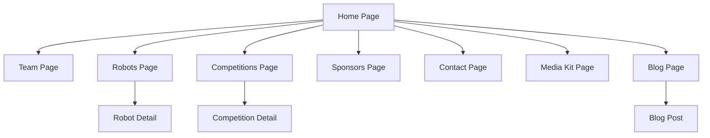

# Ragnarok Combat Robotics Website - Implementation Plan

## Design System

### Color Palette

| Token | Value | Usage |

|-------|-------|-------|

| `--bg-primary` | `#000000` | Main background |

| `--bg-secondary` | `#0A0A0A` | Card backgrounds, sections |

| `--accent-primary` | `#440C13` | Primary accent (deep crimson) |

| `--accent-hover` | `#5C1019` | Hover states |

| `--accent-glow` | `rgba(68, 12, 19, 0.5)` | Glow effects |

| `--text-primary` | `#FFFFFF` | Headlines, primary text |

| `--text-secondary` | `#A1A1A1` | Body text, descriptions |

| `--text-muted` | `#666666` | Tertiary text |

| `--border` | `#1A1A1A` | Subtle borders |

| `--grid-line` | `rgba(68, 12, 19, 0.15)` | Background grid lines |

### Typography

- **Headlines**: `Space Grotesk` or `Instrument Sans` (bold, geometric, engineering feel)
- **Body**: `Inter` or system fonts for readability
- **Monospace**: `JetBrains Mono` for technical specs/stats

### Background Pattern

Engineering cutting mat grid pattern using CSS:

- Subtle grid lines (10px spacing for minor, 100px for major)
- Lines in `--grid-line` color with varying opacity
- Optional: animated gradient glow that follows cursor

---

## Site Architecture



### Route Structure

```
/                    - Home (hero + key sections preview)
/team                - Team overview, members, history
/robots              - Robot gallery with filters by weight class
/robots/[slug]       - Individual robot detail page
/competitions        - Competition history timeline
/competitions/[slug] - Individual competition breakdown
/sponsors            - Current sponsors + sponsorship tiers
/contact             - Contact form + sponsorship inquiry
/media               - Press kit, downloadable assets, social links
/blog                - News and updates
/blog/[slug]         - Individual blog post
```

---

## Page Specifications

### 1. Home Page (`/`)

**Hero Section**

- Full viewport height
- Animated tagline: "Engineering Victory" or "Built to Dominate"
- Subtitle: "Combat robotics team pushing the limits of engineering"
- Primary CTA: "Partner With Us" (mailto link)
- Secondary CTA: "View Our Robots"
- Background: Animated grid with subtle particle effects or gradient orbs

**Stats Bar** (horizontal scroll on mobile)

- Competitions entered
- Win rate percentage
- Weight classes competed
- Years active

**Featured Robot Section**

- Showcase latest/flagship robot
- 3D-style card with hover parallax effect
- Quick specs overlay
- Link to full robot page

**Competition Highlights**

- Carousel of recent competition results
- Video thumbnail embeds (YouTube)
- Animated bracket visualization

**Sponsor CTA Section**

- "Why Partner With Ragnarok?"
- Value propositions in grid cards
- Prominent email CTA button

**Footer**

- Navigation links
- Social media links
- Newsletter signup (optional)
- Copyright

---

### 2. Team Page (`/team`)

**Team Hero**

- Team photo placeholder
- Mission statement
- Years of experience

**Team Members Grid**

- Card for each member with:
  - Photo placeholder
  - Name, role
  - Hover: brief bio

**Timeline**

- Visual timeline of team history
- Key milestones and achievements

---

### 3. Robots Page (`/robots`)

**Filter Bar**

- Filter by weight class: Beetleweight, Hobbyweight, Featherweight, Middleweight
- Filter by status: Active, Retired

**Robot Grid**

- Card layout with:
  - Robot image placeholder
  - Name
  - Weight class badge
  - Win/loss record
  - Archetype tag (spinner, wedge, etc.)
- Hover: subtle lift + glow effect

---

### 4. Robot Detail Page (`/robots/[slug]`)

**Hero**

- Large robot image/render
- Name + weight class
- Status badge

**Specs Section**

- Technical specifications table
- Materials used
- Key performance metrics

**Design Evolution**

- Gallery of iterations
- CAD renders
- Engineering notes

**Competition History**

- Table of competitions entered
- Results for this specific robot

---

### 5. Competitions Page (`/competitions`)

**Timeline View**

- Vertical timeline (newest first)
- Competition cards with:
  - Event name, date, location
  - Robots entered
  - Results summary
  - Thumbnail

**Stats Overview**

- Aggregate statistics
- Charts/graphs (optional)

---

### 6. Competition Detail Page (`/competitions/[slug]`)

**Event Header**

- Event name, date, organizer
- Location

**Bracket Visualization**

- Interactive bracket showing progression
- Highlight Ragnarok's path

**Round Breakdowns**

- Each match with:
  - Opponent
  - Result
  - Video embed (YouTube)
  - Notes/reflection

**Lessons Learned**

- Engineering insights
- What worked/didn't work

---

### 7. Sponsors Page (`/sponsors`)

**Current Sponsors**

- Logo grid with links
- Tier badges (Platinum, Gold, Silver)

**Sponsorship Tiers**

- Tier cards with benefits:
  - Logo placement
  - Social media mentions
  - Event presence
  - Custom benefits

**Impact Section**

- How sponsorship funds are used
- Cost breakdown visualization

---

### 8. Contact Page (`/contact`)

**Sponsorship Inquiry**

- Prominent email link (mailto with pre-filled subject)
- Brief pitch text

**General Contact**

- Social media links
- Optional: simple contact form

---

### 9. Media Kit Page (`/media`)

**Downloadable Assets**

- Team logo (various formats)
- Robot photos
- Press release template

**Social Media**

- Links to all platforms
- Follower counts
- Recent posts embed (optional)

**Press Coverage**

- Links to articles/features

---

### 10. Blog Page (`/blog`)

**Post Grid**

- Card layout with:
  - Featured image
  - Title
  - Date
  - Excerpt
- Pagination or infinite scroll

---

## Component Library

### Core Components

| Component | Description |

|-----------|-------------|

| `Navbar` | Sticky nav with logo, links, CTA button |

| `Footer` | Links, social, copyright |

| `Button` | Primary/secondary/ghost variants |

| `Card` | Reusable card with hover effects |

| `Badge` | Weight class, status badges |

| `SectionHeader` | Consistent section titles |

| `GridBackground` | Engineering grid pattern |

| `GlowOrb` | Animated gradient orb effect |

| `StatCard` | Animated number counter |

| `Timeline` | Vertical timeline component |

| `VideoEmbed` | YouTube embed wrapper |

| `ImagePlaceholder` | Styled placeholder for missing images |

### Animation Components

| Component | Description |

|-----------|-------------|

| `FadeIn` | Scroll-triggered fade in |

| `SlideIn` | Directional slide animation |

| `ParallaxCard` | 3D tilt effect on hover |

| `CountUp` | Animated number counter |

| `GradientText` | Animated gradient text effect |

| `GridReveal` | Grid lines animate in on scroll |

---

## Technical Stack

- **Framework**: Next.js 14+ (App Router)
- **Styling**: Tailwind CSS + CSS custom properties
- **Animations**: Framer Motion
- **Icons**: Lucide React
- **Fonts**: Google Fonts (Space Grotesk, Inter)
- **Video**: YouTube embeds via `react-youtube` or native iframe
- **Deployment**: Vercel (recommended)

---

## File Structure

```
app/
  layout.tsx           # Root layout with fonts, metadata
  page.tsx             # Home page
  globals.css          # Global styles, CSS variables, grid background
  team/
    page.tsx
  robots/
    page.tsx
    [slug]/
      page.tsx
  competitions/
    page.tsx
    [slug]/
      page.tsx
  sponsors/
    page.tsx
  contact/
    page.tsx
  media/
    page.tsx
  blog/
    page.tsx
    [slug]/
      page.tsx
components/
  ui/                  # Core UI components
    Button.tsx
    Card.tsx
    Badge.tsx
    ...
  layout/              # Layout components
    Navbar.tsx
    Footer.tsx
    GridBackground.tsx
  sections/            # Page sections
    Hero.tsx
    Stats.tsx
    FeaturedRobot.tsx
    ...
  animations/          # Animation wrappers
    FadeIn.tsx
    ParallaxCard.tsx
    ...
lib/
  data/                # Static data (robots, competitions, team)
    robots.ts
    competitions.ts
    team.ts
  utils.ts             # Utility functions
public/
  images/              # Static images
  fonts/               # Custom fonts (if self-hosted)
```

---

## Key Design Elements (Next.js Inspired)

1. **Sticky Navigation**: Transparent on hero, solid on scroll with blur backdrop
2. **Grid Background**: Subtle engineering grid lines across entire page
3. **Gradient Orbs**: Floating, blurred gradient circles in accent color
4. **Card Hover Effects**: Lift + subtle glow + border highlight
5. **Scroll Animations**: Elements fade/slide in as they enter viewport
6. **Typography Hierarchy**: Large, bold headlines with generous spacing
7. **Feature Cards**: Grid of cards with icons, titles, descriptions
8. **Social Proof Section**: Showcase logos, testimonials, stats
9. **Smooth Scrolling**: Native smooth scroll behavior
10. **Responsive Breakpoints**: Mobile-first, tablet, desktop

---

## Hero Text Recommendations

**Option A - Bold & Direct**

> "Engineering Victory"

> We build machines that dominate the arena.

**Option B - Technical**

> "Precision. Power. Performance."

> Combat robotics engineered to win.

**Option C - Story-driven**

> "Ragnarok Combat Robotics"

> Where engineering meets destruction.

---

## Implementation Priority

Phase 1: Foundation

- Project setup, design system, core components
- Home page with hero, stats, sponsor CTA
- Navbar and Footer

Phase 2: Content Pages

- Team page
- Robots page + detail template
- Competitions page + detail template

Phase 3: Sponsor Focus

- Sponsors page with tiers
- Contact page with email CTA
- Media kit page

Phase 4: Blog & Polish

- Blog infrastructure
- Final animations and polish
- Performance optimization